# Keyboard Recommendation Web Project

**맞춤형 기계식 키보드 추천 웹 사이트**  
**팀명: team-04**

---

## 📌 프로젝트 개요

- 초보자도 쉽게 접할 수 있는 기계식 키보드 추천 웹사이트입니다.  
- 필터링 검색, AI 기반 GPT 추천, MBTI 추천 등을 통해 사용자 맞춤형 키보드를 추천합니다.

---

## 📌 프로젝트 최종 목표

- 기계식 키보드에 익숙하지 않은 초보자들이 쉽게 맞춤형 키보드를 선택할 수 있도록 돕는 웹 기반 추천 플랫폼을 구축하는 것입니다.
- 사용자의 선호 조건과 사용 목적, 성향에 따라 최적의 키보드를 추천하고 다양한 부가 기능(타건 테스트, AI 추천, MBTI 추천 등)을 제공하여 사용자의 경험을 극대화하는 것입니다.

---

## 📌 기본 기능

**1. 메인 페이지 구성**
 - 인기 키보드 6개를 슬라이드로 표현하여 시각적으로 강조합니다.
 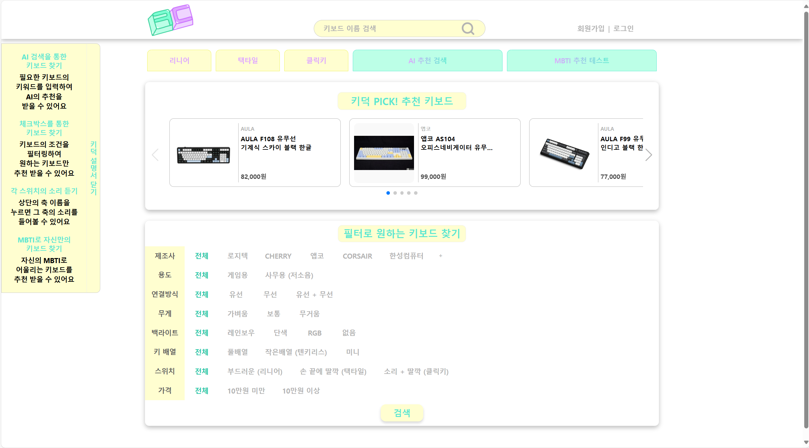
 - 상단 검색창을 통한 키보드 이름 검색(일반 검색) 기능을 제공합니다.
 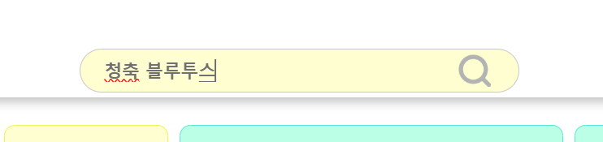
 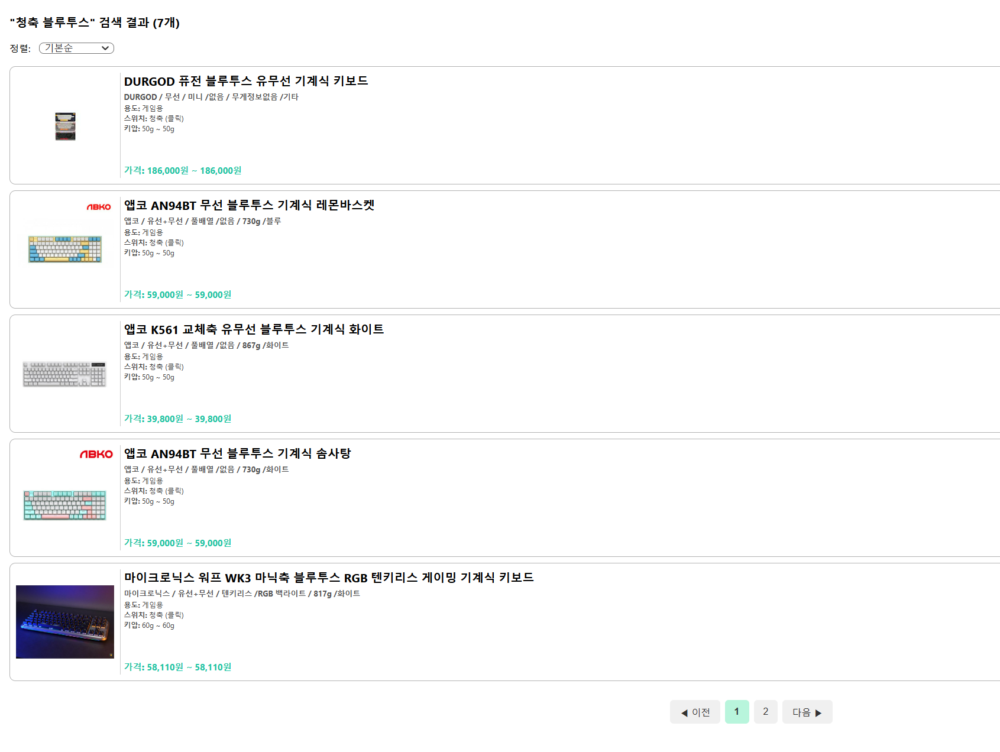

**2. 회원 관리 기능**
 - 회원가입, 로그인, 로그아웃, 비밀번호 변경, 회원 탈퇴 기능을 제공합니다.
 - 아이디 찾기(가입 시 이메일 기반) 기능을 제공합니다.
 - 비밀번호 찾기(가입 시 이메일로 임시 비밀번호 발송) 기능을 제공합니다.
 - JWT 기반 인증 시스템을 적용하여 보안을 유지합니다.
 - 사용자 접근성을 고려하여 직관적인 레이아웃을 구성합니다.
 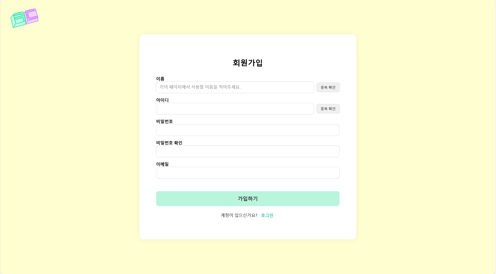
 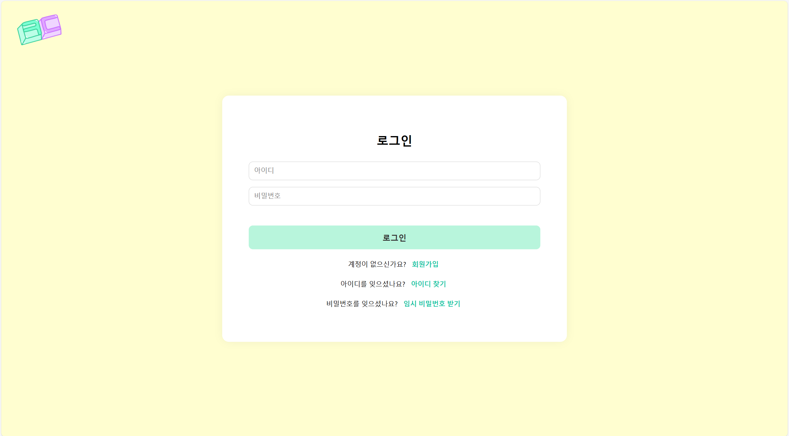
 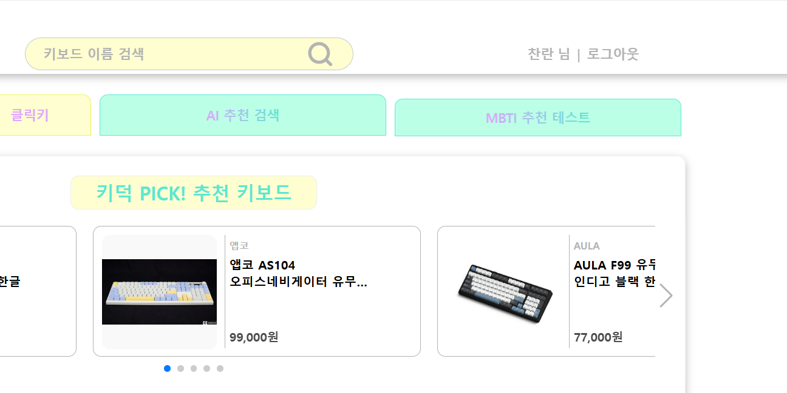
 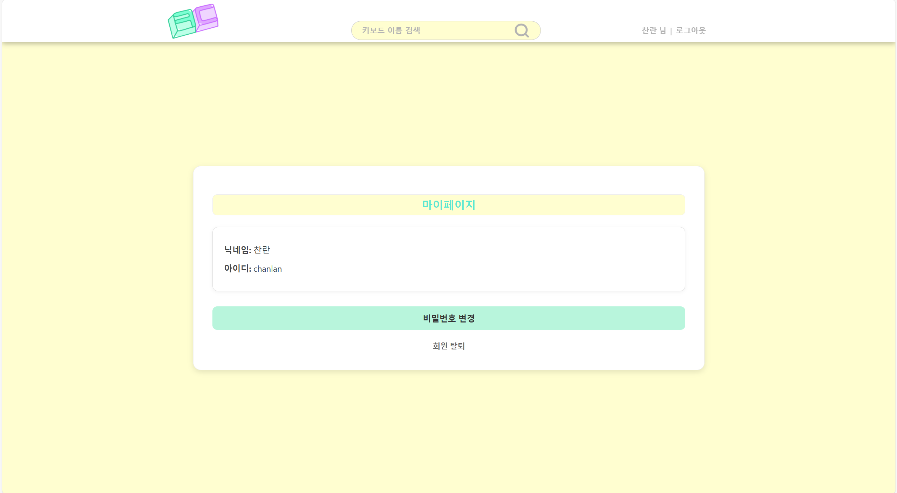

**3. 필터링 검색 기능**
 - 필터링 체크박스를 통해 사용자가 원하는 조건을 다중으로 선택할 수 있도록 합니다.
 - 필터 항목으로는 제조사, 용도, 연결 방식, 무게, 백라이트, 키 배열, 스위치, 가격이 있습니다.
 
 - 해당 조건에 부합하는 키보드를 검색하여 5개씩 페이지네이션으로 표시합니다.
 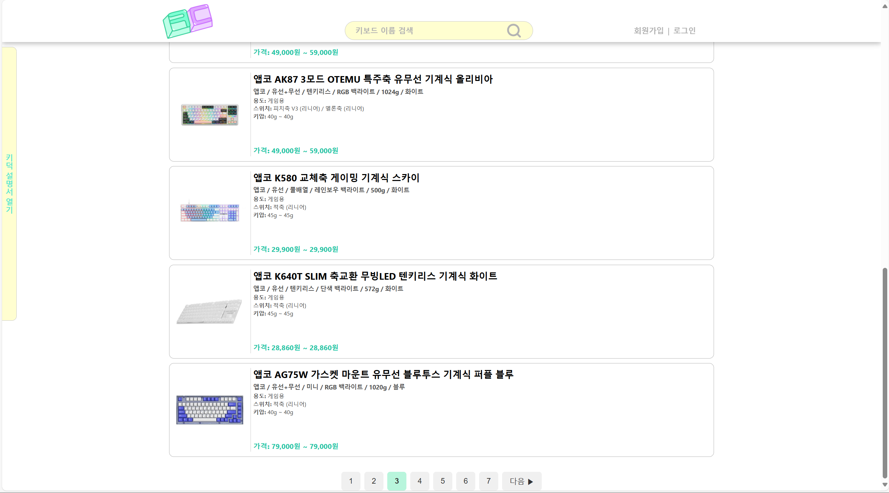
 - 정렬 기능(낮은 가격순/높은 가격순 구현)을 제공합니다.
 
**4. 키보드 상세 페이지**
 - 선택한 키보드의 공통 사양(제조사, 연결 방식, 무게, 백라이트, 키 배열, 하우징 색상)을 제공합니다.
 - 동일 모델의 다양한 스위치(축) 구성 및 가격 정보, 구매 링크를 상세하게 나열합니다.
 - 사용자가 선택한 조건과 유사한 다른 키보드 6개를 추천하는 유사 키보드 추천 박스를 구성합니다.
 - 댓글 기능을 통해 댓글을 작성, 삭제, 조회할 수 있습니다.
 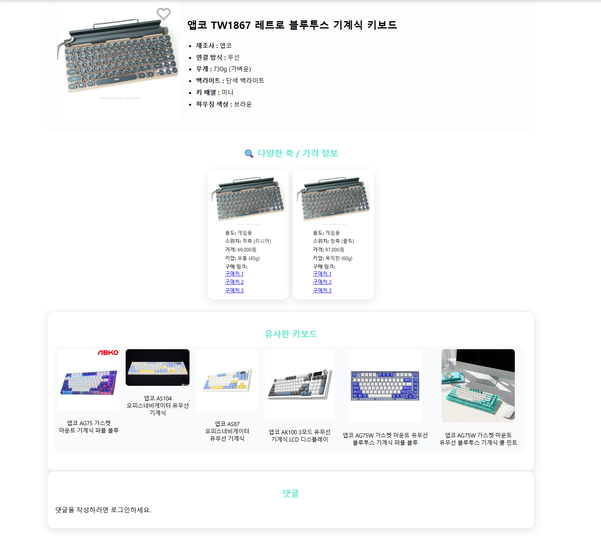
**5. 찜 기능**
 - 키보드 상세 페이지에서 하트 아이콘 클릭 시 해당 키보드를 찜 목록에 추가합니다,
 - 로그인 한 사용자만 본인의 찜 목록을 확인할 수 있습니다.
 - 찜 목록은 유지되며, 추후 사용자가 다시 확인할 수 있습니다.

---

## 📌 핵심 기능
**1. 스위치 타건 테스트 기능**
 - 메인 화면에 리니어, 택타일, 클릭키 버튼을 제공합니다.
 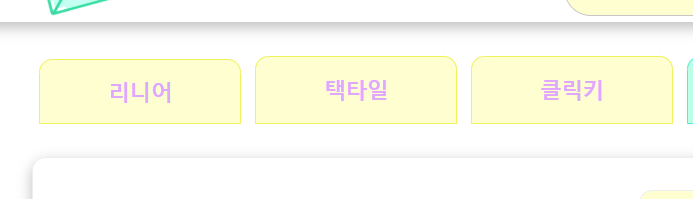
 - 각 버튼 클릭 시 타건 테스트 페이지로 이동합니다.
 - 해당 페이지에서 키보드 키를 직접 눌러 타건 소리(축별, 키별)를 실시간으로 청취할 수 있습니다.
 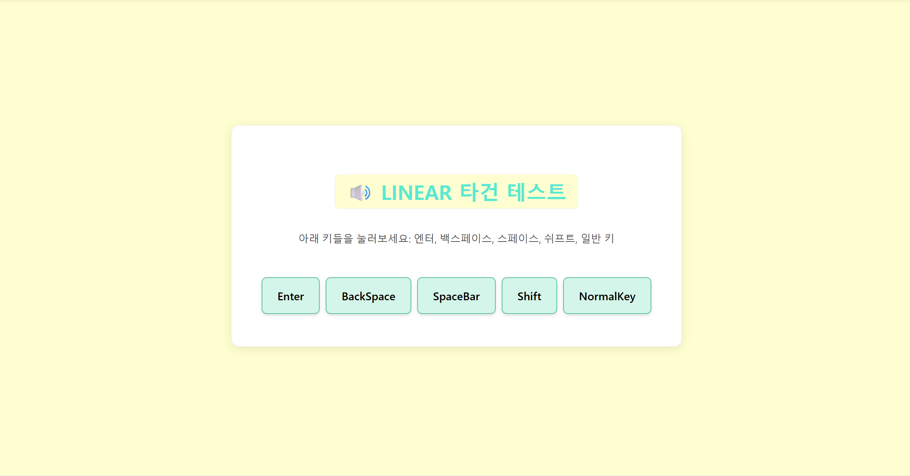
**2. AI 추천 검색 기능**
 - AI 검색창에 자연어로 원하는 키보드 조건을 입력할 수 있습니다. (예: “조용하고 저렴한 키보드 추천”)
 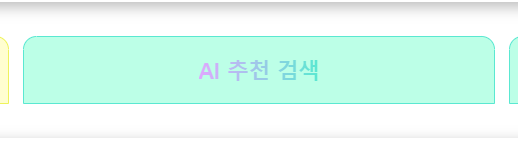
 
 - GPT가 사용자의 입력을 분석하여 조건에 부합하는 키보드를 추천합니다.
 - 추천된 결과를 필터링 UI와 동일한 형태로 표시하여 사용자 경험의 일관성을 유지합니다.
 
**3. MBTI 기반 추천 기능**
 - 12개의 질문과 2지선다형 답변으로 구성된 테스트를 제공합니다.
 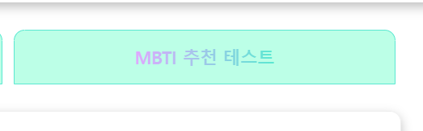
 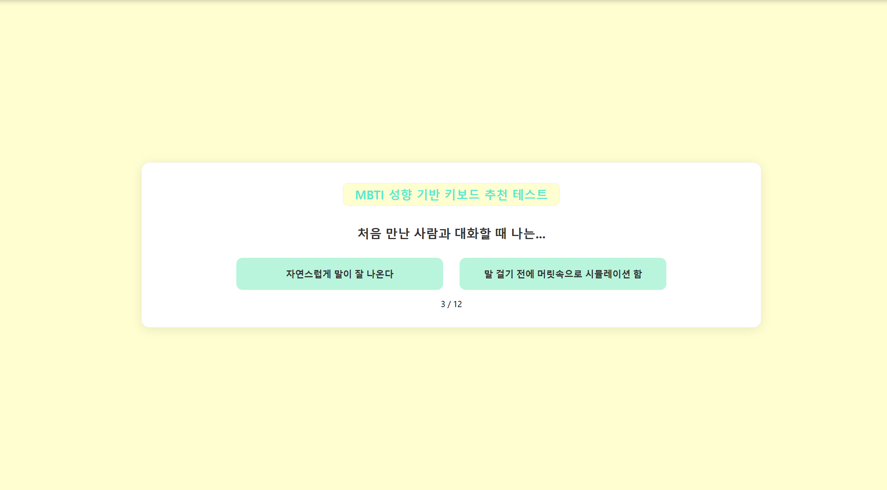
 - 사용자가 선택한 답변을 기반으로 AI가 MBTI(성향)를 분석합니다.
 - 분석된 성향에 최적화된 키보드를 추천하여 심리적/성향적 만족도를 높입니다.
---

## 📌 기술 스택

- **Frontend**: React, HTML, CSS
- **Backend**: Spring Boot, JPA, JWT, MySql, AWS EC2, S3, QueryDsl, Nginx

---

## 📌 프로젝트 기대효과

**● 초보자 진입장벽 완화**
 - 기계식 키보드에 대한 정보 부족으로 구매에 어려움을 겪는 초보자들이 직관적이고 체계적인 추천 경험을 제공받아 
  더욱 쉽게 자신에게 맞는 키보드를 선택할 수 있음
 - 타건 테스트, MBTI 기반 추천, AI 검색 기능을 통해 기존에 없던 새로운 경험을 제공함으로써 
  초보자 구매율을 높일 수 있음

**● 초보자 대상 키보드 체험 플랫폼으로 활용**
 - 스위치 타건 테스트 기능을 통해 다양한 스위치 소리를 체험해볼 수 있어 오프라인 매장에 가지 않고도 
  온라인에서 스위치별 차이 학습 가능
 - 기계식 키보드 입문자들에게 체험 기회를 제공하는 플랫폼으로 활용 가능

**● 차별화된 사용자 경험 제공**
 - 기존의 키보드 쇼핑몰들이 단순 스펙 나열과 정렬 중심이었다면, 본 플랫폼은 심리적/성향적 추천 + 체험 중심 UX를 
  제공하여 차별화된 경쟁력을 갖출 수 있음

## 📌 팀원
- 오찬란 (프론트엔드 / React - .js)
- 이세화 (프론트엔드 / React - .css)
- 김정민 (백엔드)
- 박호성 (키보드 데이터 크롤링)
- 서  적 (csv 파일 SQL 구현)
